# DASH Video Streaming Project

## 📌 Overview
This project demonstrates the implementation of Dynamic Adaptive Streaming over HTTP (DASH) using Linux-based virtual machines. The main objective is to analyze video streaming performance under different network conditions by applying traffic control techniques such as bandwidth shaping and policing.

---

## 🛠️ Tools & Technologies
- FFmpeg (video encoding and processing)
- DASH (MPD manifest and segment generation)
- Apache Web Server (content hosting)
- iPerf (network traffic generation and testing)
- Linux Traffic Control (tc)
  - Token Bucket Filter (TBF)
  - Hierarchical Token Bucket (HTB)
  - Traffic Policing

---

## 🎬 Video Processing

### FFmpeg Installation

### Video Download & Verification
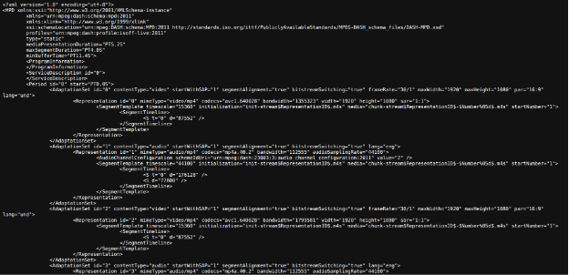

### Transcoding (1.5 Mbps, 2 Mbps, 4 Mbps)
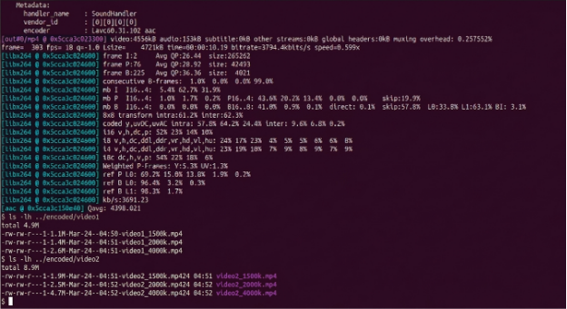

---

## 📦 DASH Packaging

### DASH Manifest & Segment Generation
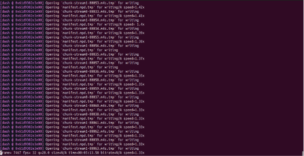
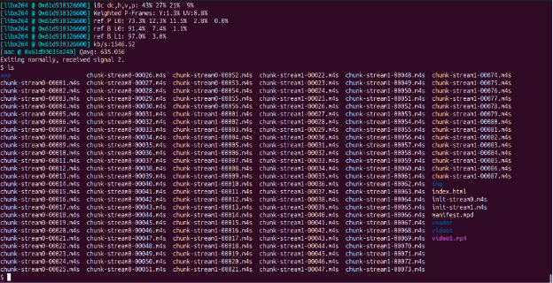
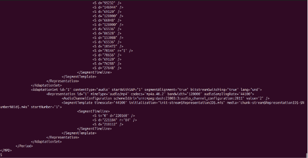

---

## 🌐 Web Server Configuration

### Apache Server Setup
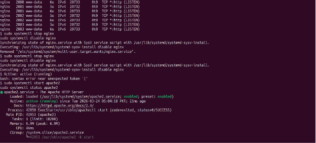

### Unique DASH URLs

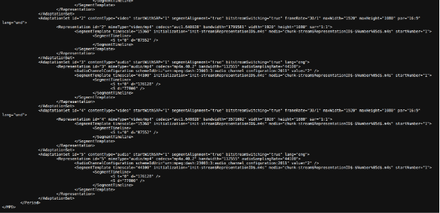

---

## 📊 Network Performance Testing

### iPerf Testing
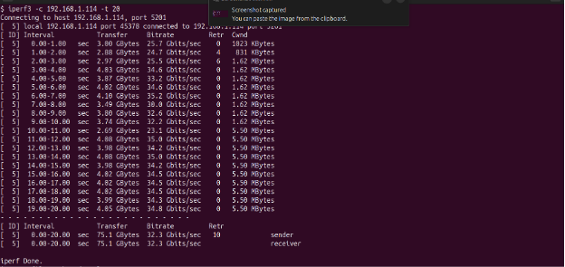

### Bandwidth Testing

---

## ⚙️ Traffic Control Implementation

### Token Bucket Filter (TBF)
- Rate: 2.5 Mbps  
- Burst: 20 KB  
- Latency: 50 ms  

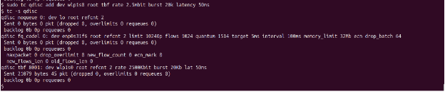

---

### Hierarchical Token Bucket (HTB)
- Minimum Rate: 2.5 Mbps  
- Maximum Rate: 5 Mbps  

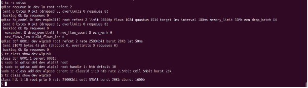

---

### Traffic Policing
- Rate Limit: 3.5 Mbps  
- Excess traffic is dropped when the threshold is exceeded  

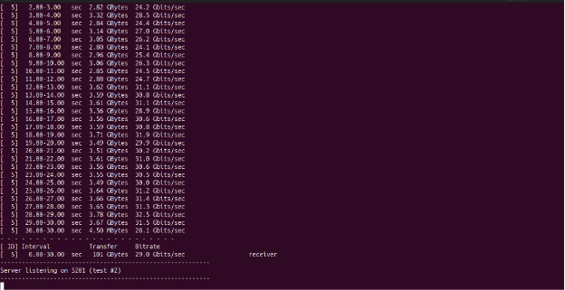

---

## ▶️ Final Streaming Output

### Successful DASH Playback
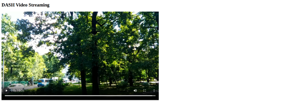

---

## 📈 Results & Observations
- DASH dynamically adjusts video quality based on available bandwidth.
- Bandwidth limitations directly affect video quality and buffering behavior.
- Traffic shaping (TBF, HTB) effectively controls bandwidth allocation.
- Traffic policing drops excess packets, reducing overall QoE.
- Network conditions play a critical role in adaptive streaming performance.

---

## 🚀 How to Run the Project

1. Install FFmpeg on the server machine.
2. Download and verify input video files.
3. Transcode videos into multiple bitrates (1.5 Mbps, 2 Mbps, 4 Mbps).
4. Generate DASH MPD files and segments.
5. Configure Apache server to host DASH content.
6. Apply traffic control rules using Linux `tc`.
7. Generate traffic using iPerf for testing.
8. Access and test streaming via a web browser.

---

## 👤 Author
Ashir
